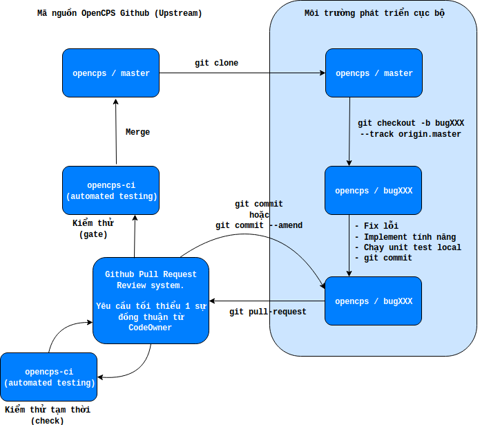

# Quy trình contribute với dự án nguồn mở OpenCPS

- [Quy trình contribute với dự án nguồn mở OpenCPS](#quy-tr%C3%ACnh-contribute-v%E1%BB%9Bi-d%E1%BB%B1-%C3%A1n-ngu%E1%BB%93n-m%E1%BB%9F-opencps)
    - [Luồng contribute tổng quát](#lu%E1%BB%93ng-contribute-t%E1%BB%95ng-qu%C3%A1t)
    - [Tổng quan](#t%E1%BB%95ng-quan)
    - [Đăng ký tài khoản github](#%C4%91%C4%83ng-k%C3%BD-t%C3%A0i-kho%E1%BA%A3n-github)
    - [Cài đặt git](#c%C3%A0i-%C4%91%E1%BA%B7t-git)
    - [Cấu hình git với github](#c%E1%BA%A5u-h%C3%ACnh-git-v%E1%BB%9Bi-github)
    - [Tạo Pull Request (PR) với Github](#t%E1%BA%A1o-pull-request-pr-v%E1%BB%9Bi-github)
    - [Đóng góp mã nguồn vào kho mã nguồn OpenCPS](#%C4%91%C3%B3ng-g%C3%B3p-m%C3%A3-ngu%E1%BB%93n-v%C3%A0o-kho-m%C3%A3-ngu%E1%BB%93n-opencps)
    - [History](#history)
    - [Credits](#credits)
    - [License](#license)
    - [References](#references)

## Luồng contribute tổng quát



## Tổng quan

Mục đích của tài liệu này nhằm giới thiệu và hướng dẫn các lập trình viên về quy trình đóng góp mã nguồn vào dự án nguồn mở OpenCPS.

Việc phát triển OpenCPS yêu cầu tối thiểu phải có tài khoản [Github](https://www.github.com) và nắm được cơ bản về luồng làm việc với [Git](https://git-scm.com/).

## Đăng ký tài khoản github

Đăng ký tài khoản Github ở [đường link này](https://github.com/join).

## Cài đặt git

Cài đặt git tham khảo [đường link này](https://git-scm.com/book/en/v2/Getting-Started-Installing-Git).

## Cấu hình git với github

1. Mở terminal
2. Thiết lập git username - đây chính là github username

```bash
$ git config --global user.name "Họ Đệm Tên"
```

3. Thiết lập thông tin email - đây là email đã đăng ký với github

```bash
$ git config --global user.email "your_email@youremail.com"
```

4. (Không bắt buộc) Upload SSH public key để xác thực nhanh hơn với github. Tham khảo [đường link này](https://help.github.com/articles/connecting-to-github-with-ssh/).
5. Kiểm tra lại các thông tin đã khai báo.

```bash
$ git config --list
```

## Tạo Pull Request (PR) với Github

1. Cách 1: Sử dụng giao diện Github

   Tham khảo [đường link này](https://help.github.com/articles/creating-a-pull-request/).

2. Cách 2: sử dụng CLI

   Yêu cầu máy đã cài đặt `python` và `pip`. Thông thường, `python` đã được cài mặc định tại các Linux Distro, tuy nhiên có thể tham khảo cách cài đặt `python` tại [đây](https://www.python.org/downloads/) và `pip` tại [đây](https://pip.pypa.io/en/stable/installing/).

   Tiến hành cài đặt `git pull-request`:

   ```bash
   $ sudo pip install git-pull-request
   ```

## Đóng góp mã nguồn vào kho mã nguồn OpenCPS

1. Fork it!
2. Create your feature branch: `git checkout -b my-new-feature`
3. Commit your changes: `git commit -am 'Add some feature'`
4. Push to the branch: `git push origin my-new-feature`
5. Submit a pull request 

## History

TODO: Write history

## Credits

TODO: Write credits

## License

TODO: Write license

## References

1. [Github Code Owner](https://github.com/blog/2392-introducing-code-owners)