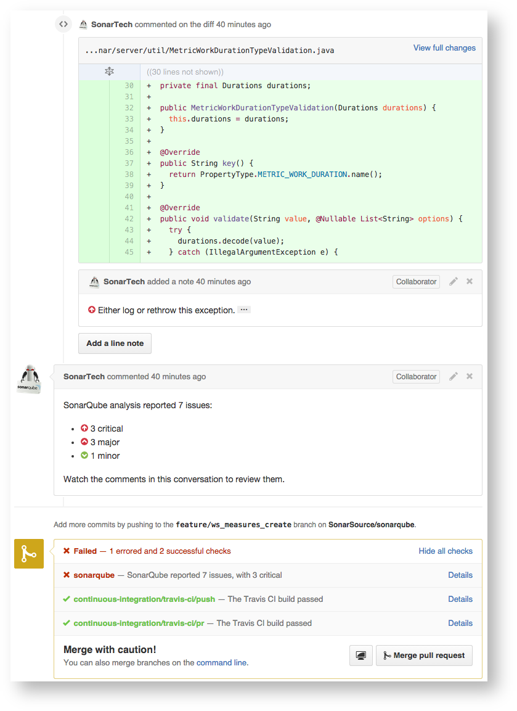

# Quy trình contribute với dự án nguồn mở OpenCPS

- [Quy trình contribute với dự án nguồn mở OpenCPS](#quy-tr%C3%ACnh-contribute-v%E1%BB%9Bi-d%E1%BB%B1-%C3%A1n-ngu%E1%BB%93n-m%E1%BB%9F-opencps)
    - [Luồng contribute tổng quát](#lu%E1%BB%93ng-contribute-t%E1%BB%95ng-qu%C3%A1t)
    - [Tổng quan](#t%E1%BB%95ng-quan)
    - [Đăng ký tài khoản github](#%C4%91%C4%83ng-k%C3%BD-t%C3%A0i-kho%E1%BA%A3n-github)
    - [Cài đặt git](#c%C3%A0i-%C4%91%E1%BA%B7t-git)
    - [Cấu hình git với github](#c%E1%BA%A5u-h%C3%ACnh-git-v%E1%BB%9Bi-github)
    - [Tạo Pull Request (PR) với Github](#t%E1%BA%A1o-pull-request-pr-v%E1%BB%9Bi-github)
    - [Đóng góp mã nguồn vào kho mã nguồn OpenCPS](#%C4%91%C3%B3ng-g%C3%B3p-m%C3%A3-ngu%E1%BB%93n-v%C3%A0o-kho-m%C3%A3-ngu%E1%BB%93n-opencps)
    - [Kiểm thử tự động và CI/CD](#ki%E1%BB%83m-th%E1%BB%AD-t%E1%BB%B1-%C4%91%E1%BB%99ng-v%C3%A0-cicd)
    - [Các nhãn (label) xuất hiện với một PR](#c%C3%A1c-nh%C3%A3n-label-xu%E1%BA%A5t-hi%E1%BB%87n-v%E1%BB%9Bi-m%E1%BB%99t-pr)

## Luồng contribute tổng quát


## Tổng quan

Mục đích của tài liệu này nhằm giới thiệu và hướng dẫn các lập trình viên về quy trình đóng góp mã nguồn vào dự án nguồn mở OpenCPS.

Việc phát triển OpenCPS yêu cầu tối thiểu phải có tài khoản [Github](https://www.github.com) và nắm được cơ bản về luồng làm việc với [Git](https://git-scm.com/).

## Đăng ký tài khoản github

Đăng ký tài khoản Github ở [đường link này](https://github.com/join).

## Cài đặt git

Cài đặt git tham khảo [đường link này](https://git-scm.com/book/en/v2/Getting-Started-Installing-Git).

## Cấu hình git với github

1. Mở terminal
2. Thiết lập git username - đây chính là github username

```bash
$ git config --global user.name "Họ Đệm Tên"
```

3. Thiết lập thông tin email - đây là email đã đăng ký với github

```bash
$ git config --global user.email "your_email@youremail.com"
```

4. (Không bắt buộc) Upload SSH public key để xác thực nhanh hơn với github. Tham khảo [đường link này](https://help.github.com/articles/connecting-to-github-with-ssh/).
5. Kiểm tra lại các thông tin đã khai báo.

```bash
$ git config --list
```

## Tạo Pull Request (PR) với Github

1. Cách 1: Sử dụng giao diện Github

   Tham khảo [đường link này](https://help.github.com/articles/creating-a-pull-request/).

2. Cách 2: sử dụng CLI

   Yêu cầu máy đã cài đặt `python` và `pip`. Thông thường, `python` đã được cài mặc định tại các Linux Distro, tuy nhiên có thể tham khảo cách cài đặt `python` tại [đây](https://www.python.org/downloads/) và `pip` tại [đây](https://pip.pypa.io/en/stable/installing/).

   Tiến hành cài đặt `git pull-request`:

   ```bash
   $ sudo pip install git-pull-request
   ```

   Cấu hình thông tin Github tại file `~/.netrc`. Lưu ý, nếu sử dụng 2FA của Github cần thay thông tin `password` bên dưới bằng [Github Personal Access Token](https://help.github.com/articles/creating-a-personal-access-token-for-the-command-line/)

   ```bash
   machine github.com login <username> password <password>
   ```

   Sau khi commit trên local branch, để tạo PR từ CLI thực hiện lệnh sau:

   ```bash
   $ git pull-request
   ```

## Đóng góp mã nguồn vào kho mã nguồn OpenCPS

1. Fork mã nguồn OpenCPS từ Github upstream và clone về máy tính

```bash
$ git clone https://github.com/<tên user>/opencps-v2
```

2. Tạo nhánh local lưu các thay đổi về code (bao gồm tính năng mới hoặc fix bugs) 

```bash 
$ git checkout -b bugXXX --track origin.master
```

3. Thực hiện implement code mới, fix bug

4. Trước khi commit, tiến hành chạy thử các bài test cơ bản: unit test, coverage test và convention test.

5. Sau khi pass qua các bài test, tiến hành commit thay đổi

```bash
$ git commit -am 'Thông điệp của commit'
```

6. Đẩy lên branch đã fork

```bash
$ git push
```

7. Tạo pull request như hướng dẫn ở [phần trên](#t%E1%BA%A1o-pull-request-pr-v%E1%BB%9Bi-github)

8. Chờ sự đánh giá (review) và phê duyệt (approval) của OpenCPS Code-Owner. Để hiểu hơn về Github Code Owner, tham khảo [link sau](https://github.com/blog/2392-introducing-code-owners).

## Kiểm thử tự động và CI/CD

1. Khi một lập trình viên tiến hành đẩy một PR lên Github, quá trình `check` của project OpenCPS sẽ được tự động thực thi thông qua Github webhook tới một server Jenkin của cộng đồng. Quá trình check này bao gồm:

- Kiểm thử Unit Test trên commit/PR mới.
- Báo cáo coverage.
- Kiểm thử convention check (quy tắc mã nguồn trong sáng)
- Kiểm thử Functional Test (test tích hợp).
- Kiểm thử an ninh mã nguồn (qua mã nguồn mở SonarQube)

  Toàn bộ quá trình kiểm thử 5 bước trên sẽ được tự động thực thi qua hai server Jenkin và Sonarqube. Kết quả sẽ được trả về ở dạng `pass/fail` ngay trên giao diện PR của người dùng như hình dưới. (ví dụ từ wiki của sonarqube)



2. Sau khi `Jenkin` và `SonarQube` chạy hết các bài test, `Jenkin` sẽ tự động gán nhãn `ready-to-review` để giúp các Code-Owner có thể filter dễ dàng hơn. PR này sẽ cần được sự đánh giá (review) và chấp thuận (approve) của các Code-Owner trước khi được merge.

3. Sau khi Code-Owner của OpenCPS approve PR, quá trình `gate` sẽ được Jenkin tự động gọi. Quá trình `gate` là quá trình:

- Tự động rebase, update PR hiện tại với nhánh master của upstream repo.
- Chạy lại toàn bộ các test ở quá trình `check` với code mới nhất sau khi rebase.
- Nếu `Pass`, Jenkin sẽ tự động merge PR với nhánh master.

## Các nhãn (label) xuất hiện với một PR

Qua phần [Kiểm thử tự động và CI/CD](#ki%E1%BB%83m-th%E1%BB%AD-t%E1%BB%B1-%C4%91%E1%BB%99ng-v%C3%A0-cicd), có thể thấy một PR khi được khởi tạo sẽ được tự động gán các nhãn (label) khác nhau, mục đích để các Code-Owner có thể dễ dàng lọc và theo dõi tình trạng các PR tiện hơn.

Phần này tổng hợp các label có thể gán cho một PR:

| Nhãn              | Ý nghĩa                                                                 |
| ----------------- |:-----------------------------------------------------------------------:|
| `check`           | PR mới, đang ở trong quá trình `check`                                  |
| `ready-to-review` | PR đã pass quá trình `check`, sẵn sàng để Code-Owner có thể review code |
| `gate`            | PR đã được review và approve, đang trong quá trình `gate`               |
| `merged`          | PR đã pass quá trình `gate` và được merge vào nhánh chính               |